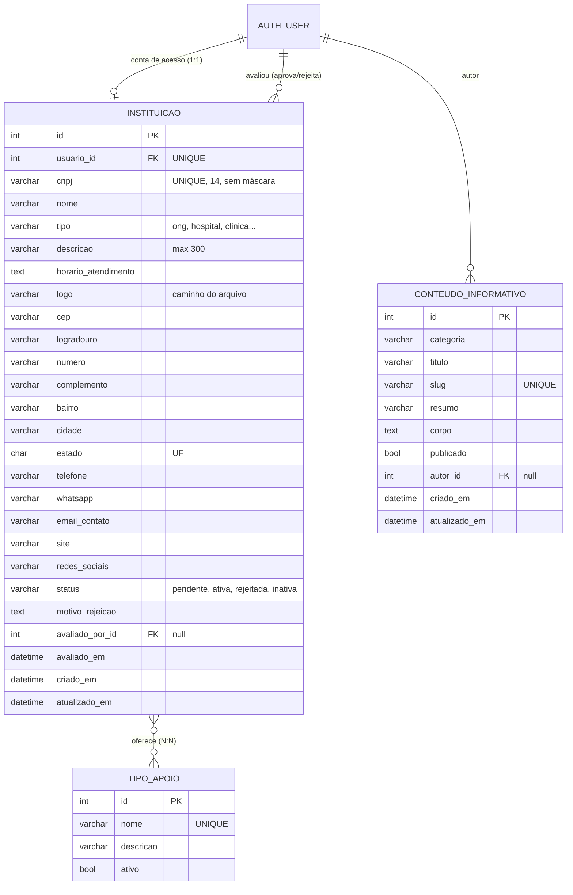

# Banco de dados — ApoioOnco

SQLite por padrão (arquivo `db.sqlite3`). MySQL opcional via variáveis de ambiente (ver `core/settings.py`).
As tabelas são criadas pelas migrações do Django: `python manage.py migrate`.

## Diagrama ER



A tabela de ligação N:N (`ongs_instituicao_servicos`) é criada automaticamente pelo Django.

## Tabelas

| Tabela | Para que serve | Origem no front-end |
|---|---|---|
| `auth_user` (do Django) | E-mail (username) e **senha com hash** de cada instituição; também os administradores (`is_staff`) | Etapa "Acesso" do cadastro; tela de login |
| `ongs_instituicao` | Cadastro completo da instituição + status de aprovação | Cadastro (etapas 1–4), "Meu perfil", dashboards, busca |
| `ongs_tipoapoio` | Banco de perucas, Banco de lenços, Apoio psicológico, Assistência social (novos podem ser criados no admin) | Checkboxes do cadastro e chips do perfil |
| `ongs_instituicao_servicos` | Quais apoios cada instituição oferece | idem |
| `ongs_conteudoinformativo` | Textos de "Entenda o câncer", "Saúde emocional", "Autoestima" | Seção "Informações para você" |

## Ciclo de vida do cadastro (`status`)

`pendente` (cadastro enviado) → `ativa` (aprovada, aparece na busca) ou `rejeitada` (com `motivo_rejeicao`).
Uma instituição ativa pode ser colocada como `inativa` (some da busca sem perder os dados).
Quem avaliou e quando ficam em `avaliado_por` / `avaliado_em`.

## Regras garantidas pelo banco / models

- CNPJ único, salvo sem máscara, com validação de dígito verificador (**numérico e alfanumérico**, formato em uso desde jul/2026).
- Um usuário ↔ uma instituição (`OneToOne`); apagar o usuário apaga a instituição.
- Pelo menos um contato (telefone, WhatsApp, e-mail ou site) é obrigatório.
- UF restrita às 27 siglas; CEP no formato `00000-000`.
- Se um administrador for excluído, as instituições que ele avaliou **não** são apagadas (`SET_NULL`).
- Índice composto `(status, estado, cidade)` acelera a busca pública.

## Comandos úteis

```bash
python manage.py migrate                 # cria/atualiza o banco
python manage.py createsuperuser         # cria o administrador do painel /admin/
python manage.py popular_exemplo         # (opcional) instituições FICTÍCIAS para testar a busca
python manage.py test                    # roda os testes
```
